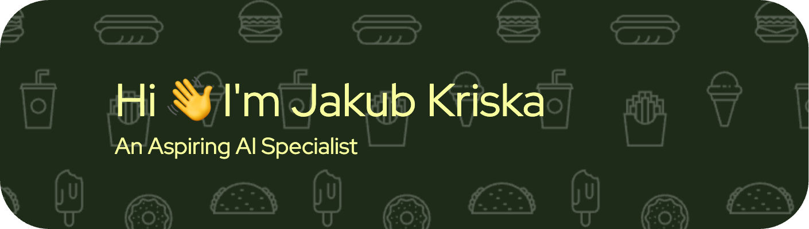

<h1 align="center">A journey into a new universe</h1>
<h3 align="center">What's going on?</h3>

- 🔭 I’m currently working on **Provider Data Network System**

- 🌱 I’m currently learning more about **AWS, RAG, LLM training**

- 💬 Ask me about **Use of AI in the field of Education**

- 📫 How to reach me **jakub.kriska@gmail.com**

<h3 align="left">Connect with me:</h3>

&nbsp;

